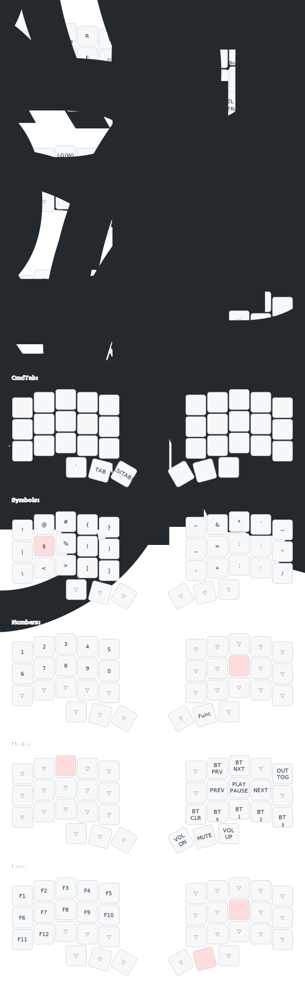

# Notes

This is my personal note-space for documenting how the setup of my keyboard works.
This keyboard is based on:
- https://github.com/davidphilipbarr/Sweep
- https://github.com/davidphilipbarr/popcorn
- https://www.reddit.com/r/ErgoMechKeyboards/comments/qcdndh/is_there_such_a_thing_as_a_36key_ferris_sweep/

## Caveats

- use ANSI when connecting to new MacBook via bluetooth
- check bluetooth media channel if one of the halfs does not connect properly (number shown on display)

## Firmware upgrade

- Run GH workflow to compile new artifacts
- Download and unzip firmware from GH
- For each keyboard-half:
  - Attach keyboard to Computer via USB-C cable
  - Allow accessory to connect
  - Double-tap the white small key at top of keyboard. Keyboard should become available as external device in Finder
  - Allow accessory to connect (again)
  - Drag&drop the (correct) firmware into the device in finder
  - Ignore error "The Finder can’t complete the operation because some data in ... can’t be read or written."
  - Unplug cable

## Resources
                                                                                                                                                               
- https://www.typingclub.com/
- https://monkeytype.com/

## Tools

### keymap drawer

https://github.com/caksoylar/keymap-drawer

```zsh
brew install pipx
pipx ensurepath
pipx install keymap-drawer
keymap parse -b keymap.yaml -c 10 -z ./config/boards/shields/kodama/kodama.keymap > keymap.yaml
keymap draw -j layout.json keymap.yaml > keymap.svg
```

# Final keymap


