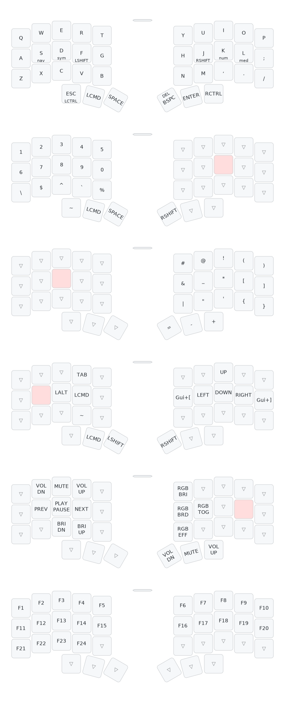

# Notes

This is my personal note-space for documenting how the setup of my keyboard works.

Specs:

- Hardware from https://keebmaker.com. Corne 36, Low Profile, Wireless (nice nano), with RGB underglow
- ZMK firmware
- prebuilt corne_left & corne_right shields

## Caveats

- use ANSI when connecting to new MacBook via bluetooth
- check bluetooth media channel if one of the halves does not connect properly (number shown on display)
- the hardware shipped by keebmaker has 36 physical keys, but supports 42 keys.
  Therefore, the keymap is padded by a column of &none on the outermost left and right.

## Firmware upgrade

- Run GH workflow to compile new artifacts
- Download and unzip firmware from GH
- For each keyboard-half:
    - Attach keyboard to Computer via USB-C cable
    - Allow accessory to connect
    - Double-tap the white small key (flash mode). Keyboard should become available as external device in Finder
    - Allow accessory to connect (again)
    - Drag&drop the (correct) firmware into the device in finder
    - Ignore error "The Finder can’t complete the operation because some data in ... can’t be read or written."
    - Unplug cable

## Resources

- https://www.typingclub.com/
- https://monkeytype.com/

## Tools

### keymap drawer

https://github.com/caksoylar/keymap-drawer

```zsh
brew install pipx
pipx ensurepath
pipx install keymap-drawer
just draw
```

# Final keymap


